# Git

## 版本控制

版本控制是一种在开发过程中用于管理我们对文件、目录或工程等内容的修改历史，方便查看更改历史记录，备份以便恢复以前的软件工程技术。

+ 实现跨区域多人协同开发
+ 追踪和记载一个或者多个文件的历史记录
+ 组织和保护你的源代码和文档
+ 统计工作量
+ 并行开发、提高开发效率
+ 跟踪记录整个软件的开发过程
+ 减轻开发人员的负担，节省时间，降低人为错误

没有进行版本控制或者版本控制本身缺乏正确的流程管理，在软件开发过程中将会引入很多问题，如软件代码的一致性、软件内容的冗余、软件过程的事物性、软件开发过程中的并发性、软件源代码的安全性，以及软件的整合等问题。

### 集中化的版本控制

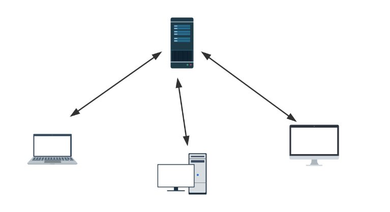

集中化的版本控制系统诸如CVS, SVN 以及Perforce 等，都有一个单一的集中管理的服务器,保存所有文件的修订版本，而协同工作的人们都通过客户端连到这台服务器,取出最新的文件或者提交更新。多年以来,这已成为版本控制系统的标准做法,这种做法带来了许多好处,现在,每个人都可以在一定程度上看到项目中的其他人正在做些什么。而管理员也可以轻松掌控每个开发者的权限，并且管理一个集中化的版本控制系统;要远比在各个客户端上维护本地数据库来得轻松容易。
事分两面，有好有坏。这么做最显而易见的缺点是中央服务器的单点故障。如果服务器宕机一小时，那么在这一小时内， 谁都无法提交更新，也就无法协同工作。

### 分布式的版本控制

由于上面集中化版本控制系统的那些缺点，于是分布式版本控制系统面世了。
在这类系统中，像Git, BitKeeper 等,客户端并不只提取最新版本的文件快照，而是把代码仓库完整地镜像下来。

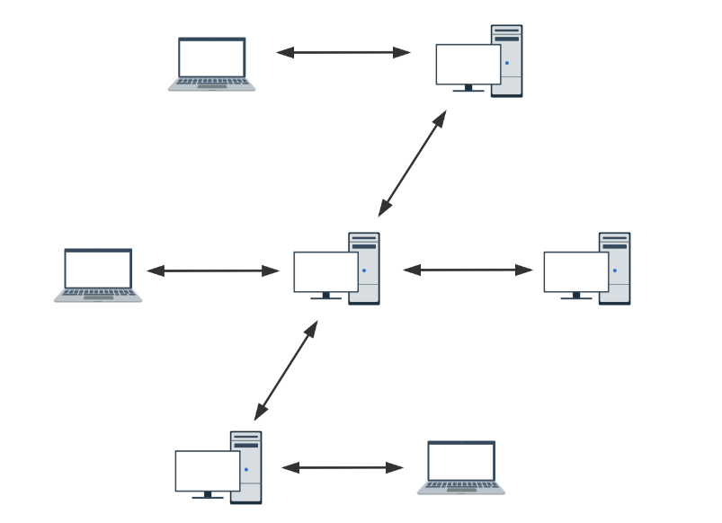

更进一步，许多这类系统都可以指定和若干不同的远端代码仓库进行交互。这样，你就可以在同一个项目中分别和不同工作小组的人相互协作。

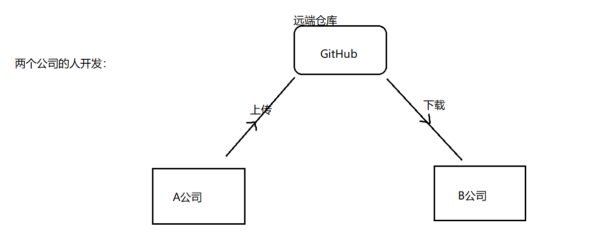

分布式的版本控制系统在管理项目时存放的不是项目版本与版本之间的差异.它存的是索引(所需磁盘空间很少所以每个客户端都可以放下整个项目的历史记录)

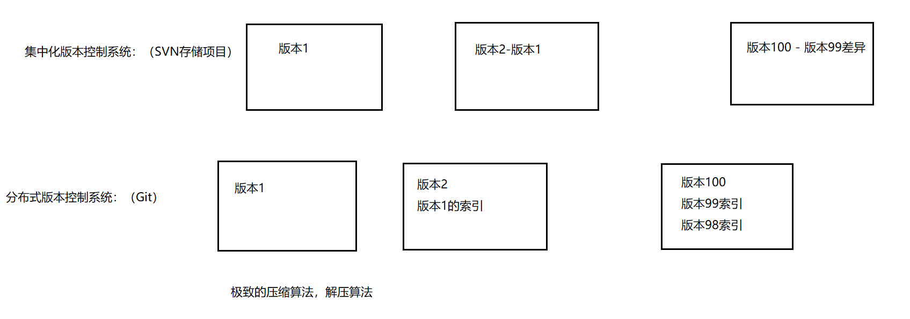

## 基本Linux命令

+ cd：改变目录。
+ cd..：回退到上一个目录。直接cd进入默认目录。
+ pwd：显示当前所在目录的路径。
+ ls(ll)：都是列出当前目录中的所有文件，ll更加详细。
+ touch：新建一个文件，如touch index.js就会在当前文件目录下新建一个index.js文件。
+ rm：删除一个文件，rm index.js就会把inedx.js文件删除。
+ mkdir：新建一个目录，就是新建一个文件夹。
+ rm -r：删除一个文件夹，rm -r src 删除src目录。
+ mv：移动文件，mv index.html src  移动index.html到src。
+ reset：重新初始化终端，清屏。
+ clear：清屏。
+ history：查看命令历史。
+ help：帮助。
+ exit：退出。

## Git基本原理

Git本地有三个工作区域：工作目录（working directory）、暂存区（stage/index）、资源库（repository或git directory）。如果再加上远程的git仓库（remote directory）就可分为4个工作区域。转换关系如下：

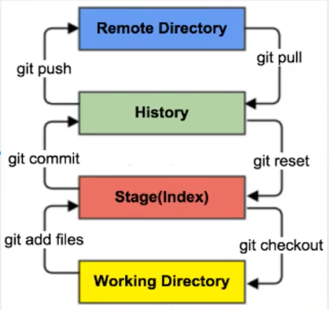

Workspace：工作区，就是平时存放项目代码的地方。

Index/Stage：暂存区，用于临时存放你的改动，事实上它只是一个文件，保存即将提交的文件列表信息。

Repository：仓库区（本地仓库），就是安全存放数据的位置，这里面有你提交到所有版本的数据。其中HEAD指向最新放入仓库的版本。

Remote：远程仓库，托管代码的服务器，可以简单地认为是你项目组中的一台电脑用于远程数据交换。

我们已经有了本地库，本地库可以帮我们进行版本控制，为什么还需要代码托管中心呢？
它的任务是帮我们维护远程库，
下面说一下本地库和远程库的交互方式，也分为两种：团队内部合作、跨团队合作。

托管中心种类：

局域网环境下：  可以搭建GitLab服务器作为代码托管中心，GitLab可以自己去搭建
外网环境下：可以由GitHub或者Gitee作为代码托管中心，GitHub或者Gitee是现成的托管中心，不用自己去搭建 

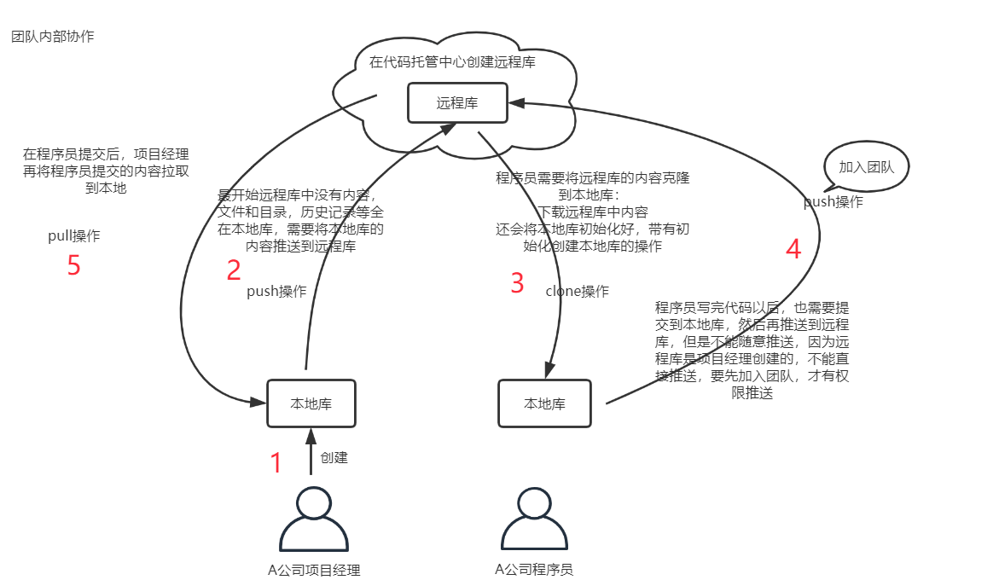

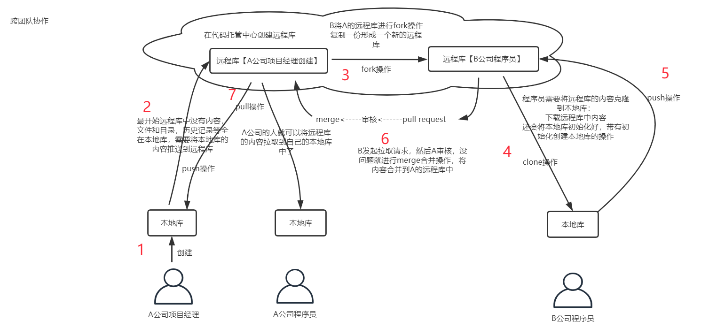

## 初始化本地仓库

1. 桌面创建一个文件夹：GitResp。

2. 打开Git终端：
   Git Bash Here

3. 在Git中命令跟Linux是一样的：
   （1）查看git安装版本：git --version

   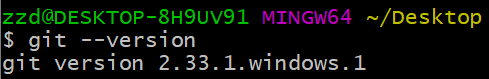

   （2）设置签名：

   设置用户名和邮箱：

   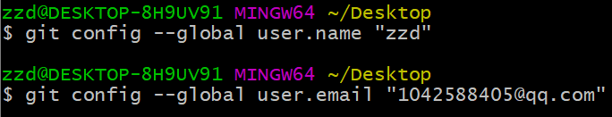

   （3)本地仓库的初始化操作：

   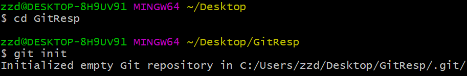

.git目录是隐藏的：可以调出来查看：

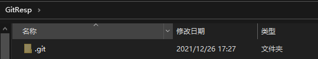

查看.git下内容：

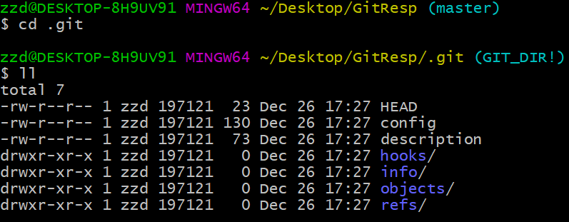

注意事项： .git目录下的本地库相关的子目录和子文件不要删除，不要胡乱修改。

**克隆远程仓库**：

```js
$ git clone url
```

## git文件操作

+ 查看指定文件状态：git status [filename]  

+ 查看所有文件状态：git status

+ 添加指定文件到暂存区：git add zzd.txt

+ 添加所有文件到暂存区：git add.   

+ 提交暂存区中的内容到本地仓库   -m是提交信息： git commit -m "..."

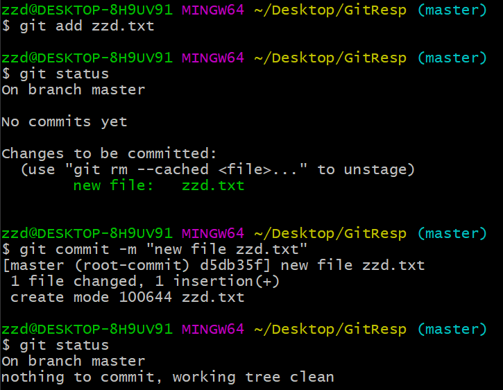

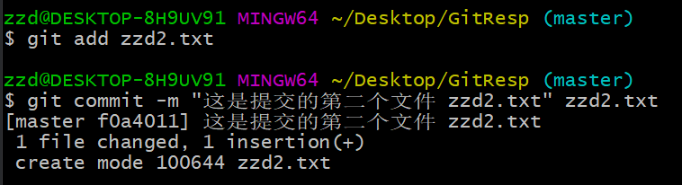


+ 查看提交的，显示从最近到最远的日志：git log

  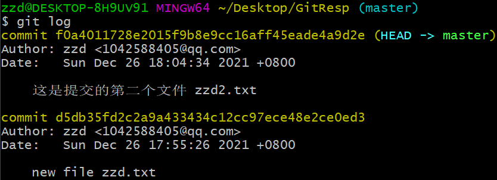

  当历史记录过多的时候，查看日志的时候，有分页效果，分屏效果，一页展示不下，下一页：空格；上一页： b
  到尾页了 ，显示END；退出：q。

  还有三种方式：

  HEAD@{数字}，这个数字的含义：指针回到当前这个历史版本需要走多少步

  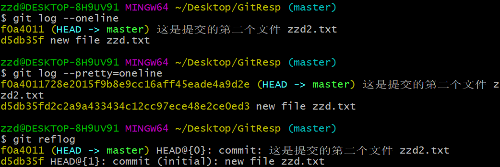

+ 前进或后退历史版本：git reset       在终端中选中就是复制了；右键paste粘贴。

  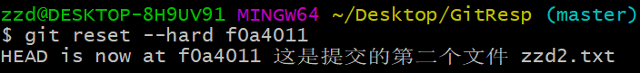

+ 删除文件，找回文件：新建 一个Test2.txt文件，将它add到暂存区中，再通过commit提交到本地库。通过rm Test.txt删除工作区中的Test2.txt，将删除操作同步到暂存区和本地库；通过git reflog查看日志，找回文件实际上就是将历史版本切换到刚才添加文件的那个版本即可。
+ 比较工作区中和暂存区中所有文件的差异：git diff

忽略文件：

有时候我们不想把某些文件纳入版本控制中，比如数据库文件，临时文件，设计文件等。在主目录下建立.gitignore文件，此文件有如下规则：

1. 忽略文件中的空行或以井号开始的行将会被忽略。
2. 可使用Linux通配符。例如*代表任意多个字符，？代表一个字符，[abc]代表可选字符范围，{string1,string2,...}代表可选的字符串等。
3. 如果名称最前面有一个感叹号表示例外规则，将不被忽略。
4. 如果名称最前面有一个路径分隔符/表示要忽略的文件在此目录下，而子目录中的文件不忽略。
5. 如果名称最后面有一个路径分隔符/表示要忽略的是此目录下该名称的子目录，而非文件（默认文件或目录都忽略）。

```js
*.txt     //忽略所有.txt结尾的文件
!lib.txt  //但lib.txt除外
/temp     //仅忽略项目根目录下的TODO文件，不包括其它目录temp
build/    //忽略build/下的所有文件
doc/*.txt   //忽略doc/notes.txt 但不包括doc/server/arch.txt
```

## 分支

**什么是分支：**
在版本控制过程中，使用多条线同时推进多个任务。这里面说的多条线，就是多个分支。

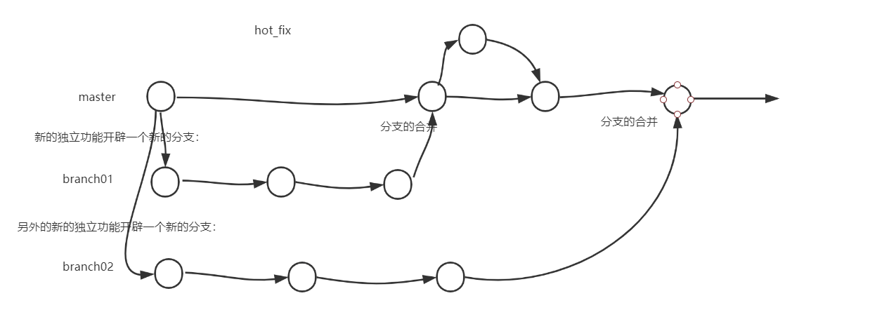

**分支的好处：**
同时多个分支可以并行开发，互相不耽误，互相不影响，提高开发效率
如果有一个分支功能开发失败，直接删除这个分支就可以了，不会对其他分支产生任何影响。

**查看、创建、切换分支：**

查看分支：git branch -v

创建分支：git branch branch01

切换分支：git checkout branch01

**冲突问题：**

【1】进入branch01分支，增加内容aaaaa：

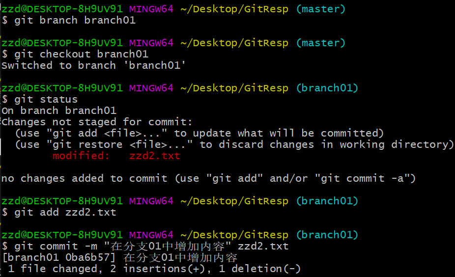

【2】将分支切换到master，然后在主分支下 加入内容cccccc：

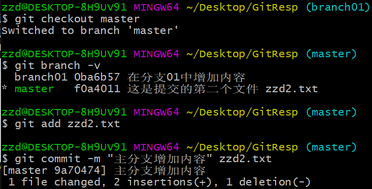

【3】再次切换到branch01分支查看：

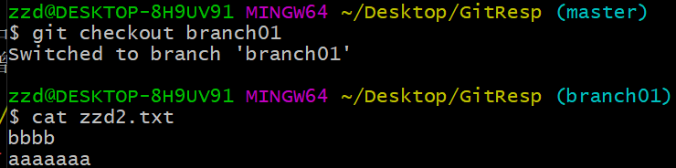

【4】将branch01分支合并到主分支 ：

进入主分支，将branch01中的内容和主分支内容进行合并：

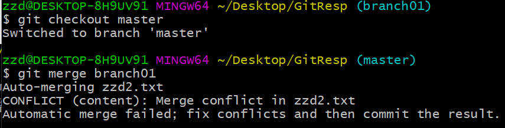

查看文件：出现冲突：

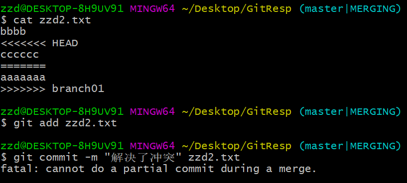

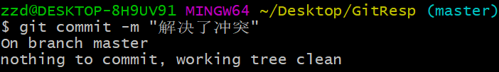

解决：
公司内部商议解决，或者自己决定  人为决定，留下想要的即可，然后将工作区中内容添加到暂存区，提交到本地库时不能够带文件名。

# github

## 给远程库起别名

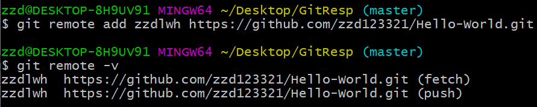

## 把本地库推送到远程库（推送操作）

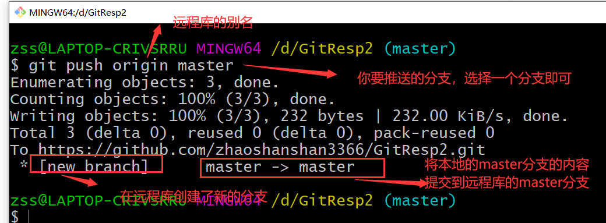

## 复制远程库（克隆操作）

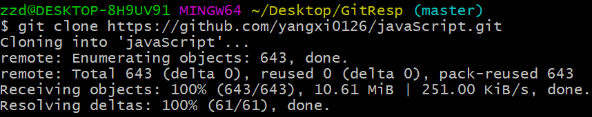

克隆操作会自动创建远程库的别名为origin

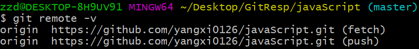

## 邀请加入团队，push操作

你从别人那复制过来的库如果想提交内容上去需要加入他的团队，然后会让你输账号密码。

必须要加入团队：登录项目经理的账号，邀请普通成员：

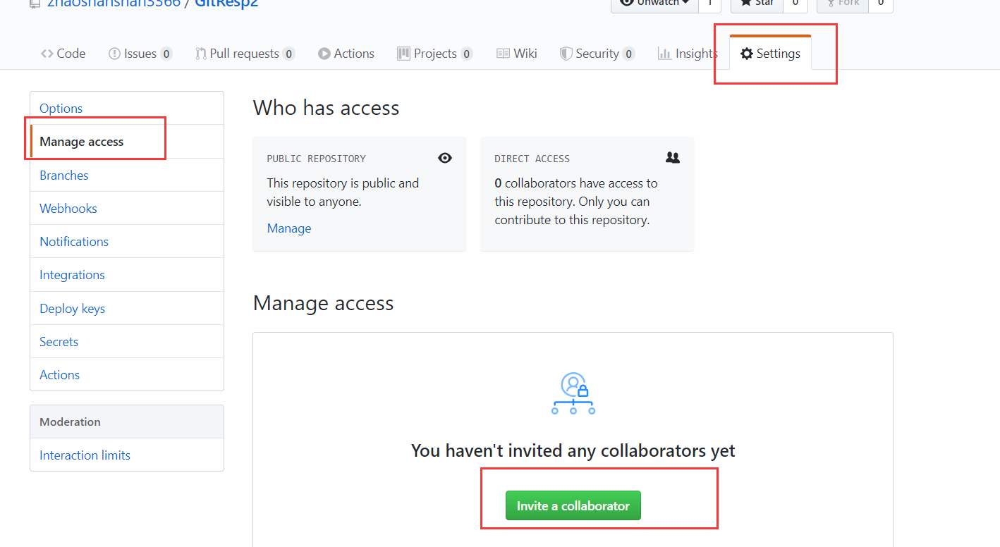

登录被邀请者的账号，接收邀请：（在地址栏录入邀请链接即可：https://github.com/zhaoshanshan3366/GitResp2/invitations）

## 远程库被修改之后的拉取操作

拉取操作 pull操作，相当于  fetch+merge  

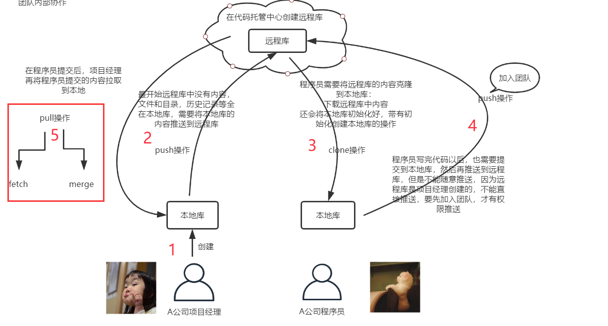

项目经理先确认远程库内容是否更新了，然后进行拉取：
（1）先是抓取操作fetch:

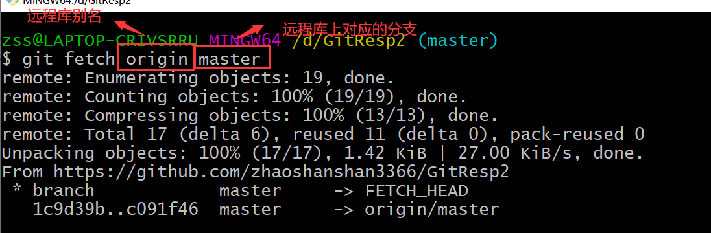

在抓取操作执行后，只是将远程库的内容下载到本地，但是工作区中的文件并没有更新。工作区中还是原先的内容：

抓取后可以去远程库看看内容是否正确：

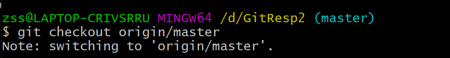

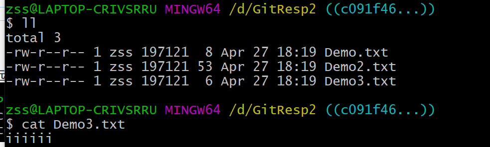

然后发现内容都正确，就可以进行合并操作了合并之前应该将分支切换回来

（2）进行合并：merge:

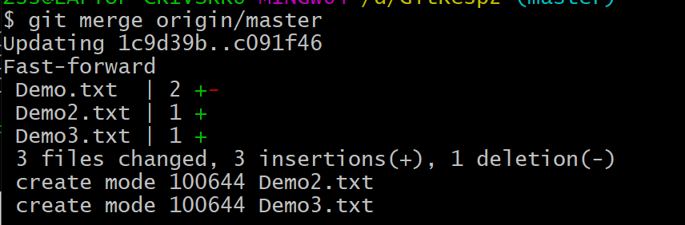

远程库的拉取可以直接利用pull命令来完成：

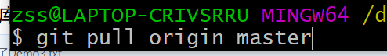

fetch+merge操作：--->为了保险，慎重         pull --->代码简单，省事

## 协同开发合作时冲突的解决方法

A向远程库推送了数据，B做了一个拉取操作，然后修改了文件后推送给远程库，A也修改了文件并推送给远程库会失败，这时A应该先拉取，然后修改冲突，然后推送给远程库。注意提交给本地库时不要带文件名。

## 跨团队合作交互方式

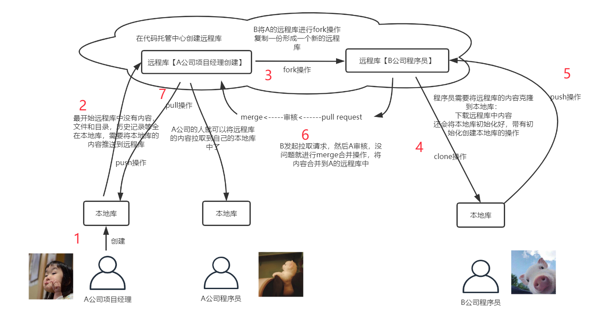

fork操作

pull resquests操作

## SSH免密登录

免密操作：

1. 进入用户主目录：cd ~

2. 执行命令，生成一个.ssh的目录：

   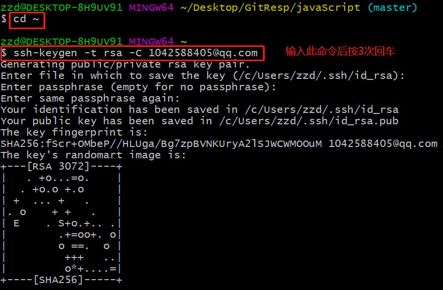

3. 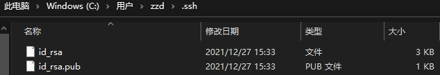

   打开.pub文件，复制里面的内容。

4. 打开github账号，在settings里面粘贴：

   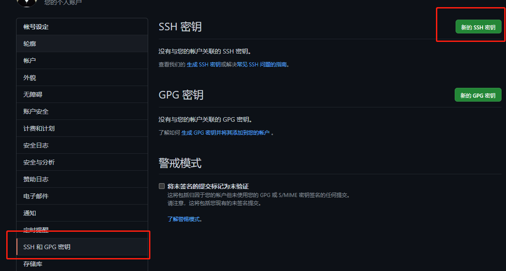

生成密钥以后，就可以正常进行push操作了。
对ssh远程地址起别名：

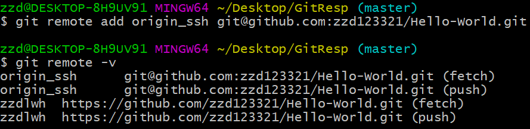

ssh方式好处：   不用每次都进行身份验证。

